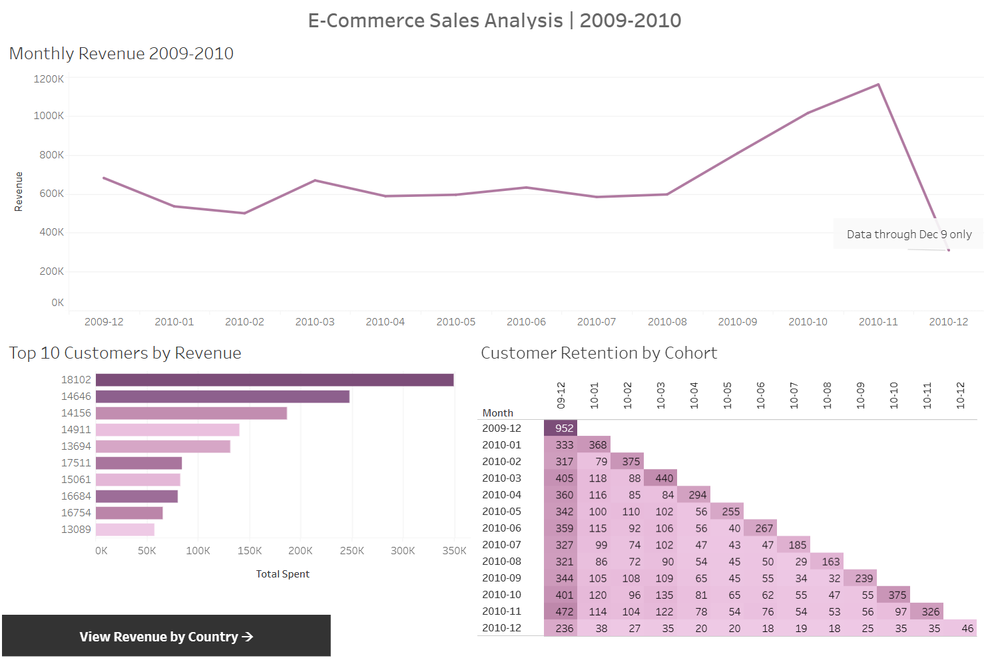

# E-Commerce Sales Analysis | 2009–2010

## Project Overview
This project analyzes transactional data from a UK-based online retailer to uncover revenue trends, identify high-value customers, and measure customer retention using cohort analysis. The dataset contains over 500,000 rows of raw transaction data spanning December 2009 through December 2010.

**Tools Used:** MySQL, Tableau  
**Skills Demonstrated:** Data cleaning, aggregation, window functions, CTEs, cohort analysis  
**Dashboard:** [View on Tableau Public](https://public.tableau.com/app/profile/andrew.wilding/viz/E-CommerceSalesAnalysis_17772394545870/Dashboard1)

---

## Dataset
**Source:** [Online Retail II — UCI Machine Learning Repository](https://archive.ics.uci.edu/dataset/502/online+retail+ii)  
**Raw Rows:** 525,461  
**Cleaned Rows:** 406,301  

---

## Data Cleaning
Before analysis, the raw dataset was cleaned to remove records that would skew results. The following steps were taken:

| Step | Rows Removed |
|---|---|
| Cancelled orders (invoice starting with 'C') | 10,206 |
| Missing customer ID | 107,560 |
| Invalid prices or quantities (≤ 0) | 45 |
| Non-product stock codes (postage, fees, test entries) | 1,349 |
| **Total removed** | **119,160** |

Junk stock codes were identified through exploratory analysis using a regex query to flag non-numeric codes, then manually reviewed to distinguish legitimate product variants (e.g. `85123A`) from non-product entries (e.g. `POST`, `ADJUST`, `TEST001`).

---

## Analysis

### 1. Monthly Revenue Trend
Revenue was relatively flat from January through August (~$500K–$650K/month), then accelerated sharply through the holiday season, peaking at **$1.16M in November 2010**. The December 2010 figure of $309K reflects a partial month — data cuts off on December 9th and does not represent a true decline.

### 2. Top 10 Customers by Revenue
Customer `18102` was the highest-value customer with **$349,164 in total spend** across 89 orders, averaging $3,923 per order — consistent with a wholesale buyer rather than a retail consumer. The top 10 customers collectively account for a disproportionate share of total revenue, highlighting the importance of wholesale relationship management.

### 3. Customer Retention by Cohort
Cohort analysis tracks how many customers from each signup month returned to purchase in subsequent months.

Key findings:
- The **December 2009 cohort** (952 customers) retained approximately 35–42% of customers each month throughout the year — strong retention for e-commerce
- Most cohorts show a sharp drop after month 1 (typically ~20–25% retention), which is a normal pattern in retail
- Retention consistently improves in October and November across all cohorts, driven by holiday purchasing behavior

### 4. Revenue by Country
The United Kingdom accounts for the vast majority of revenue. Secondary markets include Germany, France, the Netherlands, and Australia, suggesting opportunities for international expansion.

---

## Files
| File | Description |
|---|---|
| `DataCleaning.sql` | All cleaning queries with inline row counts |
| `Analysis.sql` | Revenue, customer, cohort, and country queries |

---

## Dashboard Preview

*Built with Tableau Public — [View Interactive Version](https://public.tableau.com/app/profile/andrew.wilding/viz/E-CommerceSalesAnalysis_17772394545870/Dashboard1)*
